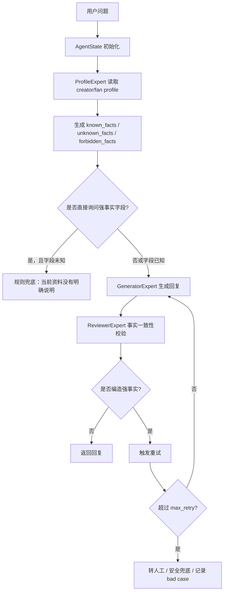

# Creator 强事实幻觉治理方案

本文档用于说明 `chatter_ai_learn` 项目中 creator 年龄、性别、生日、人设、价格、链接、素材状态等强事实字段的幻觉问题如何设计、如何落地，以及面试中如何回答。

## 1. 问题背景

在创作者商业化聊天场景里，LLM 很容易出现一种高风险幻觉：用户问 creator 的年龄、性别、生日、所在地、素材价格、PPV 链接等事实信息时，模型可能会根据上下文语气、历史训练知识或随机推断直接编一个答案。

典型 bad case：

```text
用户：她多大？
机器人：她今年 23 岁哦。
实际：creator_profile 里没有 age 字段。
```

```text
用户：这个视频多少钱？
机器人：只要 9.99 美元。
实际：当前推荐素材没有价格字段，或者价格需要由业务系统返回。
```

这类问题的本质不是“模型表达不好”，而是“模型把未知事实当成已知事实输出了”。所以不能只靠 Prompt 解决，要把它当成工程规则和事实校验问题来治理。

## 2. 设计结论

核心原则：

```text
LLM 负责表达，不负责创造事实。
强事实字段必须来自业务数据、画像数据、素材数据或工具查询结果。
如果数据不存在，系统必须明确回答不知道，不能让模型猜。
```

整体方案是四层防线：

```text
生成前：ProfileExpert 加载事实边界
生成中：Prompt 注入强约束
生成后：ReviewerExpert 做事实一致性校验
失败后：重试、兜底或转人工
```

其中 Prompt 只是其中一层，不能被当成 100% 保障。真正可靠的做法是把年龄、性别、生日、价格、链接、素材状态这类字段变成规则校验对象。

## 3. 强事实字段定义

强事实字段指不能由 LLM 自由推断的字段。

当前建议分为几类：

```text
creator 画像事实：
name、age、gender、birthday、location、persona、relationship_status

商业事实：
price、discount、refund_policy、payment_method、subscription_status

素材事实：
material_id、material_type、material_tags、ppv_sent_status、paid_link、delivery_status

对话事实：
用户是否已经购买、是否已经发送 PPV、是否承诺过价格、是否存在人工接管记录
```

这些字段必须满足：

```text
有来源才回答。
没来源就拒绝猜测。
来源冲突时不直接回答，进入降级或人工介入。
```

## 4. 当前项目中的实现

当前 P0 版本已经增加了 `ProfileExpert`，位置：

```text
src/multi_agent/experts/profile.py
```

它的职责不是生成画像，而是做事实边界识别。

### 4.1 读取事实来源

`ProfileExpert` 会从当前 `AgentState` 中读取 creator/fan 画像：

```python
state_data.get("business_info", {}).get("creator_profile", {})
state_data.get("creator_profile", {})
state_data.get("business_info", {}).get("fan_profile", {})
state_data.get("fan_profile", {})
```

这样做是为了兼容两类入口：

```text
接口业务入参 business_info.creator_profile
工作流状态字段 state.creator_profile
```

### 4.2 识别已知事实和未知事实

当前强事实字段：

```python
FACT_FIELDS = ("age", "gender", "location", "birthday", "name")
PRIVATE_FIELDS = ("age", "gender", "birthday")
```

如果 creator_profile 中存在 `age`，则进入：

```text
known_facts
```

如果不存在，则进入：

```text
unknown_facts
forbidden_facts
```

示例：

```json
{
  "known_facts": {
    "name": "Mia",
    "location": "LA"
  },
  "unknown_facts": ["age", "gender", "birthday"],
  "forbidden_facts": ["age", "gender", "birthday"]
}
```

这里的含义是：可以回答名字和所在地，但不能编造年龄、性别、生日。

### 4.3 输出事实约束

`ProfileExpert` 会把约束输出到共享上下文：

```python
"profile_constraints": {
    "do_not_invent_fields": forbidden_facts,
    "answer_unknown_with_fallback": True,
}
```

后续 `GeneratorExpert` 和 `ReviewerExpert` 可以基于这个约束判断：

```text
哪些字段可以说。
哪些字段不能说。
哪些字段被问到时必须兜底。
```

### 4.4 Supervisor 中的流程位置

在 `SupervisorAgent` 中，画像事实约束被放在 FAQ 之后、意图识别之前：

```text
input_validation
-> faq_matching
-> profile_summary
-> intention_analysis
-> recommendation
-> response_generation
-> quality_check
-> violation_detection
```

这样设计有两个好处：

```text
即使 FAQ 命中，也不会跳过强事实约束。
在进入生成前，系统已经知道哪些 creator 字段不能编。
```

## 5. 推荐的完整落地方案

当前 P0 版本已经完成事实边界识别，但要更接近生产级，需要继续补齐生成前拦截、Prompt 约束、生成后校验和降级策略。

### 5.1 生成前拦截

如果用户问题明确命中强事实查询，并且该字段在 `forbidden_facts` 中，系统可以不调用 LLM，直接返回固定兜底。

示例规则：

```text
用户问：她多大 / how old is she / age?
命中字段：age
creator_profile.age 为空
处理方式：直接兜底，不进入自由生成
```

推荐兜底话术：

```text
这个信息当前资料里没有明确说明，我不能随便猜哦。
```

这一步是最强的，因为它把高风险问题从“模型生成”变成“规则判断”。

### 5.2 Prompt 强约束

如果问题不是直接强事实查询，而是普通对话中可能涉及事实，就把约束注入 Prompt。

示例 Prompt：

```text
你只能使用 known_facts 中的 creator 信息。
forbidden_facts 中的字段禁止猜测、补全或推断。
如果用户询问 forbidden_facts 中的字段，请回答“当前资料没有明确说明”。
不要编造 creator 的年龄、性别、生日、所在地、价格、链接或素材状态。
```

注意：Prompt 只能降低概率，不能作为唯一保障。

### 5.3 生成后事实校验

`ReviewerExpert` 需要检查生成结果是否违反事实约束。

规则示例：

```text
如果 age 在 forbidden_facts 中，但回复里出现 “23岁”、“25 years old” 等年龄表达，则判定为幻觉。
如果 gender 在 forbidden_facts 中，但回复里出现 “she is female”、“he is male” 等性别判断，则判定为幻觉。
如果 price 未知，但回复里出现具体金额，则判定为幻觉。
如果 paid_link 未知，但回复里出现链接或承诺已发送，则判定为幻觉。
```

处理结果：

```text
need_regenerate = true
reason = "profile_fact_hallucination"
risk_level = "medium"
```

如果重试后仍失败：

```text
handoff_required = true
handoff_reason = "profile_fact_hallucination:max_retry_exceeded"
```

### 5.4 兜底与人工介入

触发人工介入的情况：

```text
强事实字段缺失，但用户持续追问。
Reviewer 多次发现强事实幻觉。
画像来源冲突，例如 creator_profile.age 和业务系统返回 age 不一致。
涉及退款、价格争议、承诺交付、链接不可用等商业风险。
```

系统动作：

```text
设置 handoff_required = true
设置 handoff_reason
记录 bad case
返回安全兜底话术
```

## 6. 端到端流程图



## 7. 代码层改造建议

当前已经实现：

```text
ProfileExpert：识别 known_facts、unknown_facts、forbidden_facts。
AgentState：增加 retry_count、max_retry、handoff_required、handoff_reason、risk_level、trace_id。
TaskResult：增加 confidence、quality_score、retryable、handoff_required、risk_level、reason。
SupervisorAgent：质量失败重试，超过上限转人工。
```

下一步建议实现：

```text
1. 在 AnalystExpert 中增加强事实查询意图识别。
2. 在 GeneratorExpert 中把 profile_constraints 注入 Prompt。
3. 在 ReviewerExpert 中增加年龄、性别、生日、价格、链接的规则检测。
4. 在 SupervisorAgent 中增加强事实缺失的生成前拦截。
5. 将命中的 bad case 写入 record_data 或日志系统，便于后续评估。
```

示例伪代码：

```python
if intent == "creator_profile_question":
    field = extracted_slot
    if field in forbidden_facts:
        state.final_response = "这个信息当前资料里没有明确说明，我不能随便猜哦。"
        state.task_completed = True
        return state
```

Reviewer 伪代码：

```python
if "age" in forbidden_facts and contains_age_expression(final_response):
    return TaskResult(
        success=True,
        output={
            "passed": False,
            "need_regenerate": True,
            "issues": ["profile_fact_hallucination:age"]
        },
        risk_level="medium",
        reason="profile_fact_hallucination"
    )
```

## 8. Bad Case 收集与评估指标

需要收集的 bad case：

```text
用户问题
机器人回复
creator_profile 快照
known_facts / forbidden_facts
命中的规则
是否触发重试
是否转人工
最终人工标注结果
```

核心指标：

```text
Profile Fact Hallucination Rate：强事实幻觉率
Unknown Fact Fallback Rate：未知事实兜底率
Reviewer Catch Rate：Reviewer 拦截率
Regeneration Success Rate：重生成修复率
Human Handoff Rate：人工介入率
False Refusal Rate：误拒率
```

评估样例：

```text
1000 条 creator profile 问答样本
其中 300 条询问未知年龄/性别/生日
目标：
强事实编造率 < 0.5%
未知事实兜底准确率 > 98%
误拒率 < 3%
```

## 9. 面试回答模板

如果面试官问：

```text
你们怎么解决 creator 年龄、性别回答错的问题？
```

可以这样回答：

```text
这个问题我们没有只靠 Prompt 解决，因为 Prompt 不能提供 100% 保证。

我们的设计是把 creator 年龄、性别、生日、价格、链接这类字段定义为强事实字段。生成前由 ProfileExpert 从业务上下文和 creator_profile 中提取 known_facts、unknown_facts 和 forbidden_facts。如果字段不存在，就明确标记为禁止编造。

对于用户直接询问未知强事实的情况，我们会走规则兜底，不让 LLM 自由生成；对于普通对话，我们会把 profile_constraints 注入 Prompt，让模型只能基于 known_facts 表达。生成后 Reviewer 还会做事实一致性校验，如果回复里出现了 forbidden_facts 里的年龄、性别或价格，就判定为幻觉，触发重试。超过最大重试次数后，会转人工或返回安全兜底。

所以我们的核心思路是：LLM 负责表达，不负责创造事实；强事实必须来自业务数据，没有数据就不能猜。
```

## 10. 一句话总结

```text
Creator 强事实幻觉治理的关键，不是把 Prompt 写得更凶，而是把“事实是否存在”前置成工程判断，再用 Prompt、Reviewer、重试和人工介入做多层防线。
```
